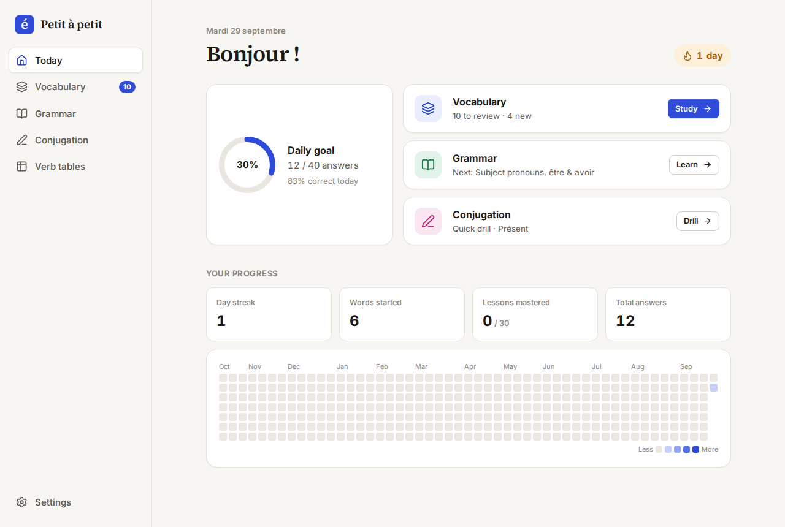
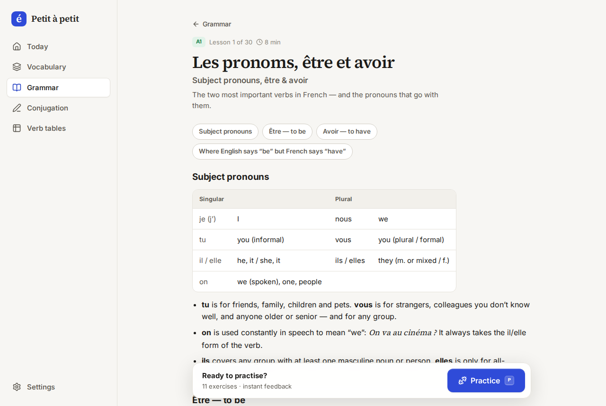
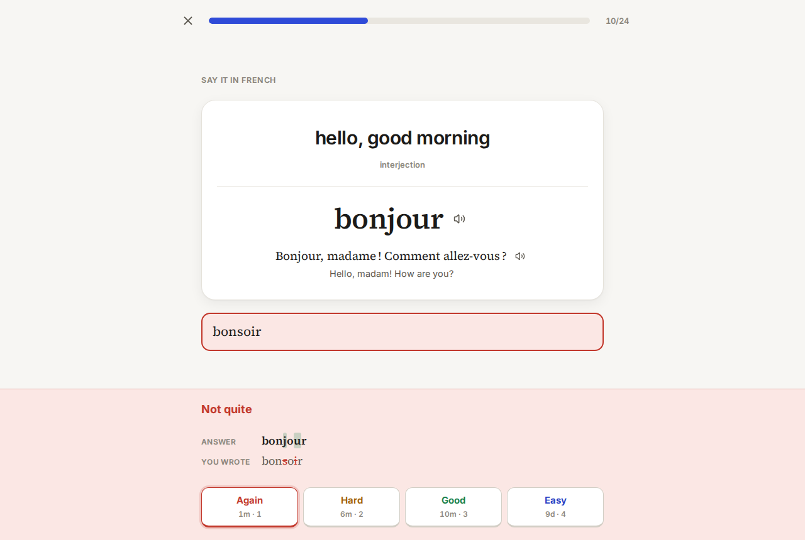
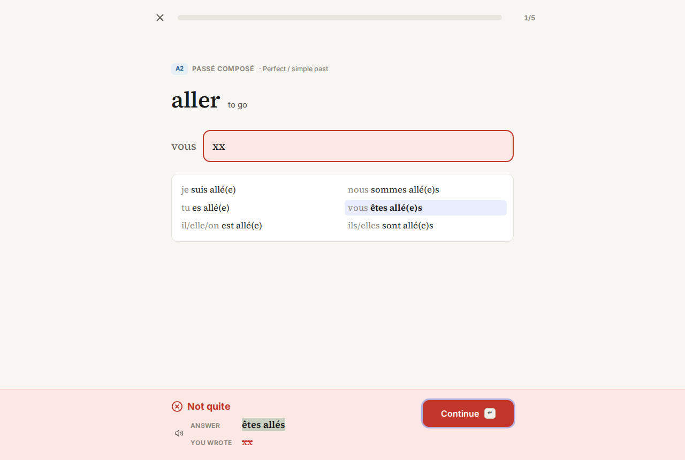
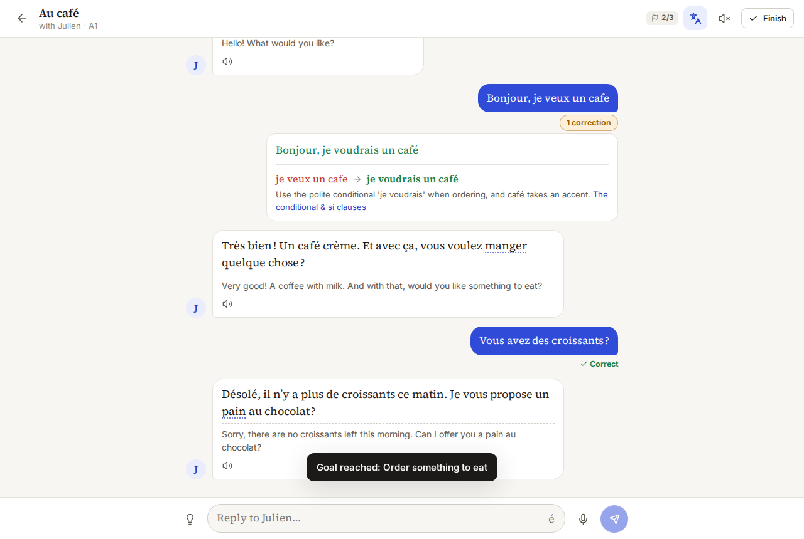
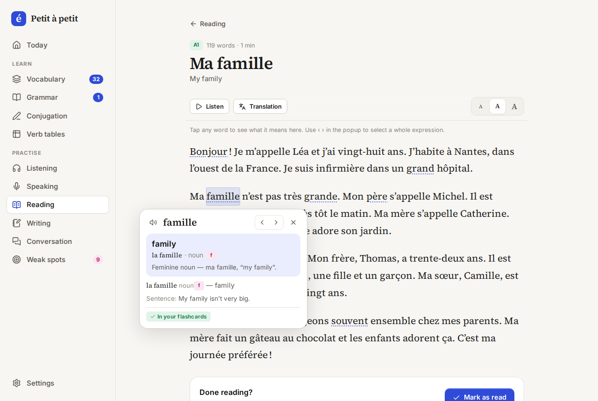
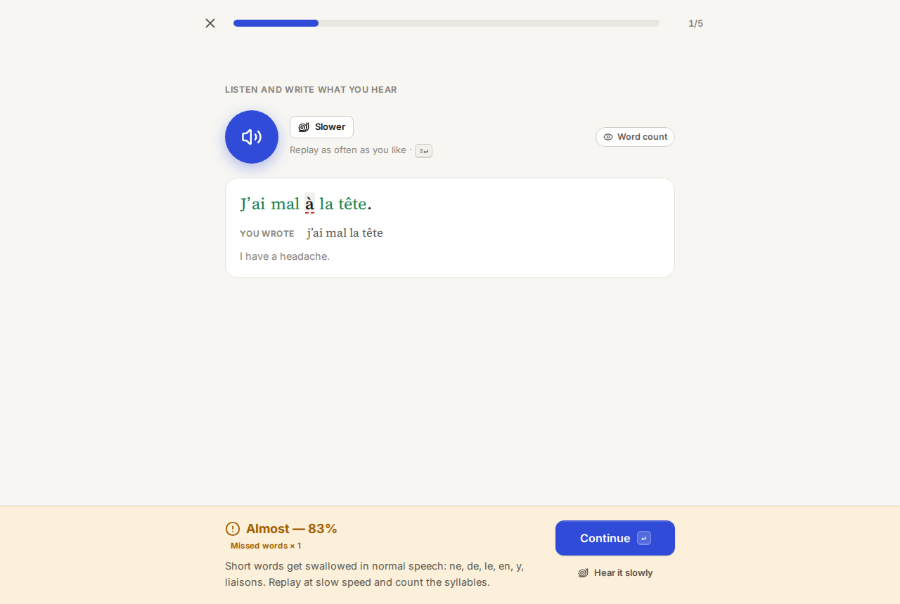
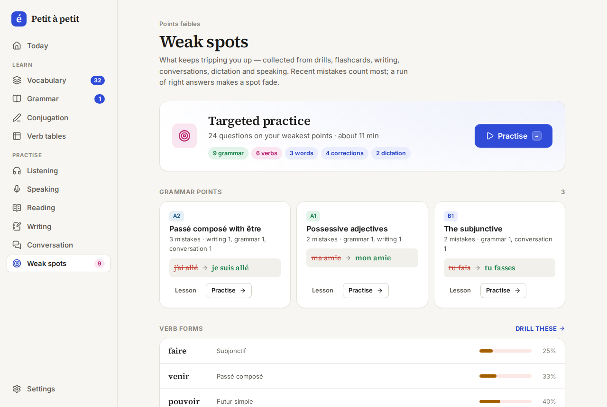

# Petit à petit — French study

A focused, keyboard-friendly web app for learning French: **grammar**, **vocabulary** and **verb conjugation** to learn, then **listening**, **speaking**, **reading**, **writing** and **conversation** to practice — plus **weak spots**, which gathers every mistake you make and drills the rules behind them. It’s built to sit alongside input-heavy tools like LingQ, Alexa and Anki and cover what they don’t.

> *Petit à petit, l’oiseau fait son nid* — little by little, the bird builds its nest.

| Today | Grammar lesson | Vocabulary (typed recall) | Conjugation drill |
| --- | --- | --- | --- |
|  |  |  |  |

| Conversation | Reading | Dictation | Weak spots |
| --- | --- | --- | --- |
|  |  |  |  |

## What’s inside

**Roadmap — level by level to TCF B2**
- *Roadmap* lists each level (A1–B2, grouped into the CEFR bands) with a one-line goal, its grammar lessons (ticked once mastered) and links to the rest of that level's content, then the TCF B2 format and target scores.

**Today’s session — one mixed daily session**
- Press **Start** (or `Enter`) on Today to get everything that’s due in one queue: vocabulary reviews, a few new words, spaced reviews of grammar lessons, practice from lessons you’ve studied, a short adaptive conjugation drill, two dictation sentences and a couple of your own past mistakes to fix.
- The kinds of practice are interleaved rather than done in blocks, which tends to improve retention. Missed words, grammar, verb and fix-it items come back a few questions later; anything you get right isn’t asked again in the same session.
- Each topic runs in course order, A1 → B2. New words go level by level across your decks (a level’s themed decks, then its frequency decks); grammar practice starts with the lowest lesson you haven’t mastered; a new tense joins the drill only once every verb has met the tenses below it; new dictation sentences come from the lowest level you haven’t heard. Reviews still come up when due, A1 first, and each question shows its level.
- Grammar points you keep getting wrong (in drills, writing or conversation) get extra questions.
- Grammar lessons that are due for review are scored inside the session, and their review schedule moves on (or resets) accordingly.
- Leaving part-way loses nothing: every answer is saved as you go, and **Continue** on Today picks the session up where you stopped (same day, same device). A lesson review left half-done is finished when you continue, or scored with the answers you gave if you don’t that day.
- Capped at about 25 reviews + 5 new words + 5 grammar + 5 verbs + 2 dictation + 2 fixes (≈15 min). Dictation and read-aloud items can be switched on or off in Settings.

**Weak spots — every mistake in one place**
- Mistakes from grammar drills, conjugation, flashcards (cards you forget), writing corrections, conversation corrections, dictation and speaking are logged together.
- They’re grouped by the rule behind them: grammar points you keep missing, verb/tense pairs with low recent accuracy, words that keep slipping, and the kinds of sounds you mishear. Recent mistakes weigh more; three right answers in a row make a spot fade.
- **Practice** builds a targeted session: exercises from your weakest lessons, the verb forms you miss, your slippery words, “fix your own sentence” items made from your writing and conversation corrections, and sentences you misheard.

**Listening — short stories and dictation**
- 16 short stories (A1 → B2, 1–2 minutes each) to listen to without the text: play, pause, skip back a sentence, slow / normal / fast. Then answer comprehension questions, check your score with explanations, and read the transcript (tap any word to look it up) with its translation. Your best score is kept for each story.
- Hear a sentence (normal or slow, as often as you like), type it, and see each word marked: right, accent slip, wrong, missed or extra.
- Mistakes are classified — silent endings (*parle / parlent*, *aimé / aimer*), sound-alikes (*a / à*, *et / est*, *ces / ses*), accents, missed little words, spelling — with a short tip for each.
- Sentences come from the words you’re learning or from any level (≈700 sentences from the decks and lessons). Sentences that went badly come back.

**Audio course — hands-free, Pimsleur-style**
- 44 audio lessons in one course from A1 to B2 (12 at A1, 12 at A2, 12 at B1, 8 at B2): a short dialogue, then each phrase modelled, built up from the end and asked for again at growing intervals, a role play where you take one part, and the dialogue once more. About 12–15 minutes each; earlier lessons are reviewed at the start of the next.

**Speaking — read aloud, listen & repeat**
- Say a sentence; speech recognition shows which words came across clearly, and you can play your recording next to the native model. Missed words get a pronunciation tip (u vs ou, nasal vowels, the French r…).
- Eight “tricky sounds” sets: u/ou, nasals, r, é/è, eu, liaison and silent letters, oi/ille/gn, tongue twisters.
- Uses the browser’s speech recognition (Chrome, Edge, Safari). In browsers without it (Firefox, Brave) recordings can be transcribed by OpenAI or Gemini if you’ve connected them — otherwise you record and compare by ear.

**Reading — graded texts and your own**
- 18 original graded texts (A1 → B2) with translations, anything you paste in, or a new story written for you at your level on any topic, using the words you’re currently learning.
- Tap any word: the dictionary entry, which verb and tense a form comes from (*allée* → past participle of *aller*), and — with an AI connected — what it means in *this* sentence. Extend the selection with ‹ › to look up whole expressions.
- Add words to your flashcards with the sentence as the example.
- **Vocabulary sidebar (LingQ-style)** beside every text and story transcript: how much of the text you know, and its words grouped into *New*, *Learning* and *Known*. In the text, new words are blue and words you're learning are yellow (switch off in the sidebar). Tap a word in the list to find it in the text, or tap one in the text to find it in the list. Each row lets you start learning the word, mark it known (it gets a card scheduled days ahead), hide it, or send a known word back to learning. *I know all* marks every new word known in one go.
- Listen to the text with sentence-by-sentence highlighting; show the translation paragraph by paragraph.
- **After reading**, every word from the text that's in your vocabulary bank is listed (rarest first) and you say whether you recognised it: known words get a recognition card scheduled days ahead, the rest start learning today (and don't use up your daily new words if you knew them). Words already in your reviews count as a review when they're due; hide any word you never want asked about.

**Conversation — role-play with an AI partner**
- 40 real situations from A1 to B2, ten per level (café, market, train tickets, hotel, lost luggage, post office, job interview, a noisy neighbour, cancelling a contract, negotiating, a radio interview, announcing bad news to a client…), each with goals to reach and useful phrases, plus free conversation on any topic.
- Replies stream in and stay in character; each of your messages is quietly checked, with corrections, the rule and the lesson that covers it.
- Stuck? Tap the lightbulb for ideas of what to say (or write in English), show translations, hear every reply aloud, tap words to look them up, dictate your answer with the microphone.
- **Finish** for feedback on the whole conversation: a score, strengths, what to work on with better phrasings, words to keep and a tip for next time.

**Writing — corrections with explanations**
- 46 writing prompts from A1 to B2, each aimed at specific grammar (e.g. *Mon week-end dernier* → passé composé), plus free writing and your own topic.
- Editor with accent keys, a word-count target, clickable “useful phrases”, and drafts saved automatically.
- Every mistake is marked inline, explained in English and linked to the lesson that teaches it. You also get a minimally corrected version, a more natural version, what you did well, and words worth keeping — added to your flashcards in one click.
- “Rewrite it yourself” lets you fix the text using the feedback and compares the two scores.

**Grammar — 53 lessons, A1 → B2**
- Full lessons, not just rules: when and why to use each structure, formation tables, irregular forms, word order, contrasts with English, dozens of audio examples per lesson, “watch out” boxes for classic mistakes and a quick summary at the end.
- Five exercise types: fill-in-the-blank, multiple choice, sentence building, translation, transformation.
- Instant feedback with a character-level diff and an explanation on every item. Wrong answers come back once at the end of the session.
- Score 80% to master a lesson; mastered lessons return for spaced review (1 → 3 → 7 → 16 → 35 → 90 days).

**Vocabulary — 5,000+ words: 29 themed decks plus the 5,000 most frequent French words**
- **Top 5000** is one switch: the most frequent French words, introduced strictly in frequency order (most common first), without themes or levels. Words that are also in a themed deck are shared, so you never learn one twice.
- Scheduled with **FSRS** (the modern algorithm Anki now uses) via [`ts-fsrs`](https://github.com/open-spaced-repetition/ts-fsrs).
- Cards work like Anki: you only see the front, guess, flip (`Space`) and rate yourself Again / Hard / Good / Easy (`1–4`). New words aren't shown with their answer first — a new word is just a card you haven't seen yet. The study screen shows Anki's counter of new · learning · review cards left.
- Every word is learned both ways: *recognition* (FR → EN) and *production* (EN → FR). **Card style** in Settings picks how EN → FR cards are answered: *Flashcard* (flip and self-rate), *Fill in the blank* (type the French — the example sentence has the word blanked out — auto-checked, then you confirm the rating) or *Mixed* (one or the other at random for each card).
- Nouns are always learned with their article; gender is colour-coded **and** labelled (m/f) so it doesn’t rely on colour alone.
- Every word has an example sentence and translation, with audio.
- “I already know this” (K) on a word’s first card skips words you know from Anki/LingQ in one keystroke.
- Add your own words, or **import from Anki / LingQ / a spreadsheet** (tab, semicolon or comma separated).

**Conjugation — 103 verbs × 9 tenses**
- A rule-based engine generates every form (regular groups, spelling-change verbs like *acheter / appeler / payer / manger*, irregulars, compound tenses with *être* agreement).
- Adaptive drills: verb/tense pairs you miss come up more often. After each answer you see the whole tense with your row highlighted.
- The prompt never gives away *j’ai* vs *je suis*; *il/elle* subjects test past-participle agreement.
- Full **verb tables** with audio for every form.

**Everything else**
- Daily goal, streak and an activity heatmap.
- Keyboard-first: `Enter` check/continue (and starts today’s session) · `Space` flip / start and stop the microphone · `1–4` rate / choose · `K` known · `Esc` leave · `S` study · `P` practice · `⇧↵` replay in dictation · `⌘↵` send writing · `Enter` send in conversation (`⇧↵` new line).
- On-screen accent keys (é è ê à ç ô û ù œ …), accent-tolerant marking (configurable), French typography (narrow spaces before `? ! : ;`).
- Text-to-speech in French via the Web Speech API — pick the best voice in Settings (on macOS, download an *Enhanced* or *Premium* French voice).
- Light and dark themes, responsive down to phone size, installable as a PWA and works offline.
- Progress lives in your browser (localStorage) and works offline. **Sign in with Google** to sync it across your phone and computer (optional — see below), or export/import a JSON backup in Settings.

## AI features — bring your own key

Writing corrections, conversation practice, meanings in context, translations and generated texts use an AI model you choose in **Settings → AI**:

| Provider | Key | Notes |
| --- | --- | --- |
| **Claude** (Anthropic) | [console.anthropic.com](https://console.anthropic.com/settings/keys) | Default: Claude Sonnet 5.5 |
| **OpenAI** | [platform.openai.com](https://platform.openai.com/api-keys) | Default: GPT-6.1 Sol. Can also transcribe speech |
| **Google Gemini** | [aistudio.google.com](https://aistudio.google.com/apikey) | Default: Gemini 3.8 Flash. Free tier; can transcribe speech |
| **OpenRouter** | [openrouter.ai](https://openrouter.ai/keys) | One key for hundreds of models (Claude, GPT, Gemini, Mistral, DeepSeek, Llama…) |
| **Other** (OpenAI-compatible) | — | Ollama, LM Studio, Mistral, Groq, DeepSeek, xAI or any `/v1/chat/completions` server |

- Pick a provider, paste its key, press **Save & test**. **Load models** lists the models your key can use; any model id can be typed in.
- Keys are stored only in this browser (localStorage, separate from progress and never in backups) and sent only to that provider. Requests go straight from the browser — there’s no server in between. A correction or a conversation typically costs about a cent.
- Responses are requested as structured JSON (schema-constrained where the provider supports it) and streamed in conversation. If a provider rejects an optional feature (JSON schema, streaming, reasoning settings), the app retries without it automatically.
- **Local models:** start Ollama with `OLLAMA_ORIGINS="*" ollama serve` (or your site’s origin), choose *Other → Ollama*, then **Load models**. In LM Studio, enable CORS in the server settings. Smaller local models work for conversation but give less reliable corrections.
- Some hosted providers don’t accept requests straight from a browser (CORS); if the test fails with a network error, use OpenRouter for that model instead.

## Getting started

Requires Node 22.12+.

```bash
npm install
npm run dev        # http://localhost:5173
```

| Script | What it does |
| --- | --- |
| `npm run dev` | Start the dev server |
| `npm run build` | Type-check and build to `dist/` |
| `npm run preview` | Serve the production build |
| `npm test` | Run the unit tests (conjugation engine, answer checking, SRS, AI client, dictation grading, weak spots, content integrity) |
| `npm run lint` | Lint with oxlint |

## Sign-in and sync (optional)

With a free [Supabase](https://supabase.com) project, people can **sign in with Google** and their progress syncs between their devices. Without it, the app works exactly the same, with progress kept in the browser.

**How it works**
- Each learner has one row in a `progress` table, protected by row-level security — nobody can read anyone else’s, except the admin (below).
- The app pulls when it opens, when you come back to the tab, every 30 seconds while it’s open and instantly when another device saves (realtime). It saves when you pause for a few seconds (at least every two minutes while you study non-stop) and right away when you leave the tab or switch apps. Progress is stored gzip-compressed to keep syncs light on mobile data.
- Progress from two devices is **merged item by item**, never overwritten: each flashcard keeps its latest review, activity from each device adds up, mistakes, writings, texts and conversations from both are kept, deletions are respected, and each study setting follows whichever device changed it last. Voice, speed, theme and AI keys stay on each device (AI keys are never uploaded).
- Saves carry a version number, so if two devices save at the same moment the second one merges and tries again instead of overwriting.
- **People** (`/people`): signed-in learners can see everyone else who has signed in and open their profile at `/profile/<id>` — the same page as your own `/profile`. After each sync the app publishes a small snapshot of your profile numbers (level, level progress, daily answers and skill mix) to a `profiles` table; your progress document, email, writing and conversations are never shared. Anyone can hide themselves with *Show me on People*. Everyone who signs up gets a profile automatically (a database trigger), and running the schema again adds anyone who signed up earlier.
- Signing in on a new device adds what you studied there to your account. After that, resetting progress or restoring a backup applies to all signed-in devices. Signing out keeps your progress on that device.

**Set it up (about 15 minutes, once)**
1. **Create a project** at [supabase.com](https://supabase.com/dashboard) (the free plan is plenty; it pauses after a week with no use and can be restored from the dashboard).
2. **Create the tables:** Dashboard → *SQL Editor* → paste [`supabase/schema.sql`](supabase/schema.sql) → *Run*. Run it again whenever it changes (it's safe to re-run) — e.g. to add People.
3. **Create a Google sign-in client** in the [Google Auth Platform console](https://console.cloud.google.com/auth/clients):
   - *Branding*: app name and support email. *Audience*: publish the app (while it’s in “Testing”, only the test users you list can sign in).
   - *Clients → Create client → Web application*. **Authorized JavaScript origins:** `http://localhost:5173` and your site (e.g. `https://french.brianrahadi.com`). **Authorized redirect URI:** the callback URL shown in Supabase under *Authentication → Sign In / Providers → Google* (`https://<project-ref>.supabase.co/auth/v1/callback`).
4. **Turn on Google in Supabase:** *Authentication → Sign In / Providers → Google* → enable, paste the client ID and secret.
5. **Allow the app’s addresses:** *Authentication → URL Configuration* → Site URL `https://french.brianrahadi.com/`; Redirect URLs `http://localhost:5173/**` and `https://french.brianrahadi.com/**`. The live site’s address is set in `.env.production` (`VITE_SITE_URL`): sign-in from anywhere but localhost returns there.
6. **Connect the app:** copy `.env.example` to `.env.local` and fill in the Project URL and publishable key from *Project Settings → API Keys*. Restart `npm run dev` — *Settings → Account & sync* now shows **Continue with Google**.
7. **For GitHub Pages:** add the same two values as repository variables (*Settings → Secrets and variables → Actions → Variables*): `VITE_SUPABASE_URL` and `VITE_SUPABASE_PUBLISHABLE_KEY`. The publishable key is meant to be public; row-level security protects the data.

**Admin dashboard**

Signed in as an admin, *Admin* appears in the sidebar (and under *Settings → Account & sync*) and opens `/admin`: every learner who has signed in, with their level, last study day, streak, answers, accuracy and words, plus how many learners studied each day. It reads through the `admin_users()` database function in `supabase/schema.sql`, which answers only the confirmed email addresses listed in `is_admin()` and refuses everyone else. To add or change an admin, edit that list and run the file again, and update `ADMIN_EMAILS` in `src/features/admin/access.ts` (which only decides who sees the link).

## Deploying

It’s a static site — any static host works.

- **GitHub Pages:** move `docs/deploy-github-pages.yml` to `.github/workflows/deploy.yml`, push to `main`, then in *Settings → Pages* set *Source* to **GitHub Actions**. The workflow tests, builds with the right base path and publishes to `https://<you>.github.io/<repo>/`.
- **Vercel / Netlify:** import the repo; build command `npm run build`, output `dist`. `vercel.json` handles client-side routes. For a sub-path, set `BASE_PATH=/your-path/` at build time.

## How it fits with LingQ, Anki and Alexa

- **LingQ / Alexa** give you input (reading and listening). Keep doing that — it’s where most acquisition happens.
- **This app** gives the structure input alone doesn’t: one grammar point at a time with feedback, active production of words (typing them, with gender), conjugation drills — and output practice (speaking, writing, conversation) with corrections, plus dictation to connect what you hear with how it’s written.
- **LingQ texts** can be pasted into *Reading* to look words up in context and send them to your flashcards with their sentence.
- **Anki:** if you already have a French deck, either keep it for vocabulary and use this app for grammar + conjugation, or import your cards (*File → Export → Notes in Plain Text*) under *Vocabulary → Add & import*.

## Project structure

```
content/          everything learners study, as Markdown — see content/README.md
  grammar/        53 lessons: explanations + exercises (a1/ … b2/)
  vocab/          29 themed decks (a1/ … b2/) + 50 frequency decks (top5000/)
  reading/        18 graded texts with translations
  stories/        16 listening stories with comprehension questions
  audio/          44 audio lessons, one course from A1 to B2
  conversations/  40 AI role-plays (goals, phrases, character brief)
  writing/        46 writing prompts linked to lessons
  pronunciation/  8 sound practice sets
src/
  content/        reads content/*.md at build time (parser + Vite plugin)
  data/           loads the content; verbs.ts (103 verbs) and soundTips.ts stay in code
  lib/
    conjugate.ts  conjugation engine
    answer.ts     normalisation, accent-tolerant checking, diffs
    french.ts     tokenising, word alignment, dictation grading, speech matching
    srs.ts        FSRS wrapper (ts-fsrs)
    store.ts      persisted app state (zustand) incl. the mistake log
    sync/         Supabase sign-in and sync (engine) and item-by-item merging (merge)
    mistakes.ts   records mistakes from every kind of practice
    speech.ts     French text-to-speech
    recognition.ts microphone: speech recognition, recording, level meter
    ai/           providers (Claude, OpenAI, Gemini, OpenRouter, OpenAI-compatible),
                  client (streaming, JSON, fallbacks), writing feedback
  features/       today, roadmap (level-by-level guide), session (daily + weak-spot sessions), vocab, grammar,
                  conjugation, verbs, listening, speaking, reading, talk,
                  writing, weak, practice, privacy, settings
  components/     shared UI (feedback sheet, accent bar, dialogs, AI setup…)
  styles/         design tokens, base, components, sessions, features, practice
```

### Adding content

Lessons, words, texts, role-plays, writing prompts and pronunciation sets are Markdown files in [`content/`](content/README.md). Copy a neighbouring file, change the `id` and the text, and save; `npm run dev` picks it up immediately. [`content/README.md`](content/README.md) has a template for each kind.

- **A verb:** add it to `src/data/verbs.ts`. Regular verbs need only the infinitive; irregular ones need the present, past participle and any irregular future/subjunctive stems.

`npm test` checks the content for you (every file parses, unique ids, well-formed exercises, balanced markup, every verb conjugating in every tense, role-plays and prompts pointing at real lessons). A mistake in a content file names the file and line.

## Tech

React 19 · TypeScript · Vite 8 · React Router 8 (data mode, route-level code splitting) · zustand · ts-fsrs · lucide icons · Inter + Source Serif 4 (self-hosted) · vite-plugin-pwa · Vitest.
# french
